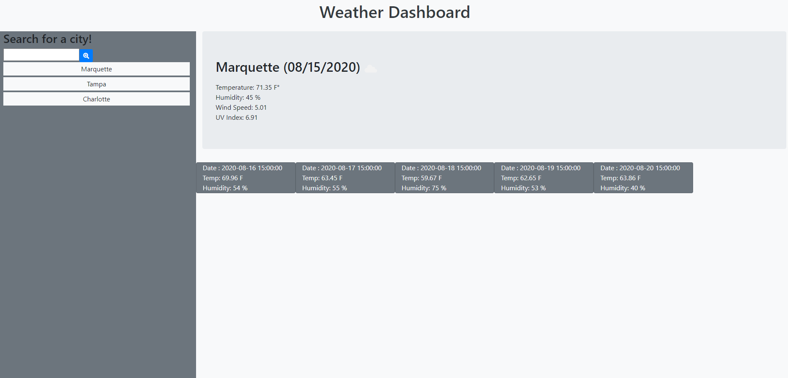

# Weather Dashboard

# This weather dashboard works using the OpenWeather API to retreive weather data for the user. The API returns third party data such as city temperature, wind, and heat index. Local storage stores the user's previously visited cities on the left side column. User may click on the city previously earched to re-view weather data for that city.

